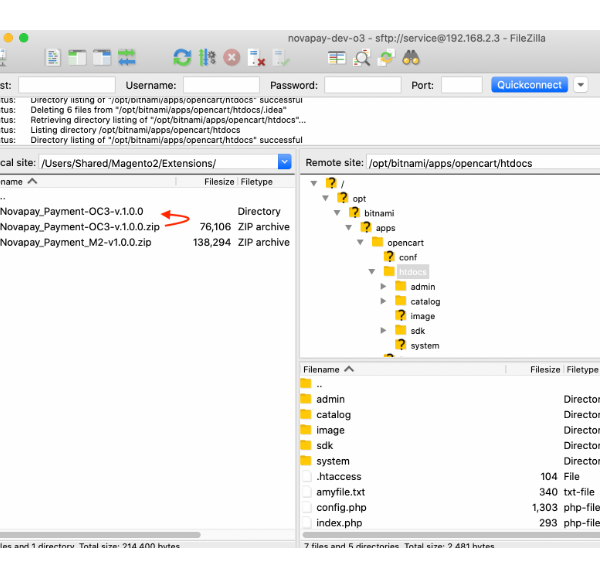
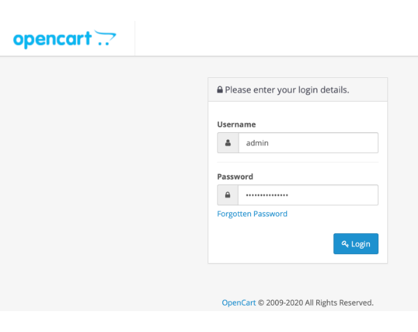
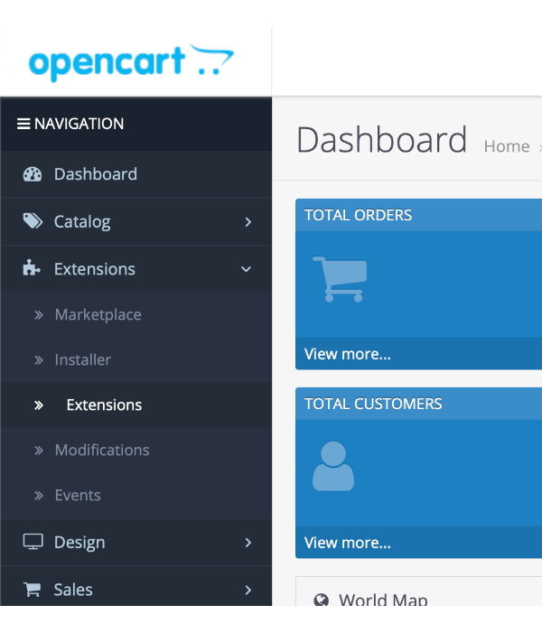
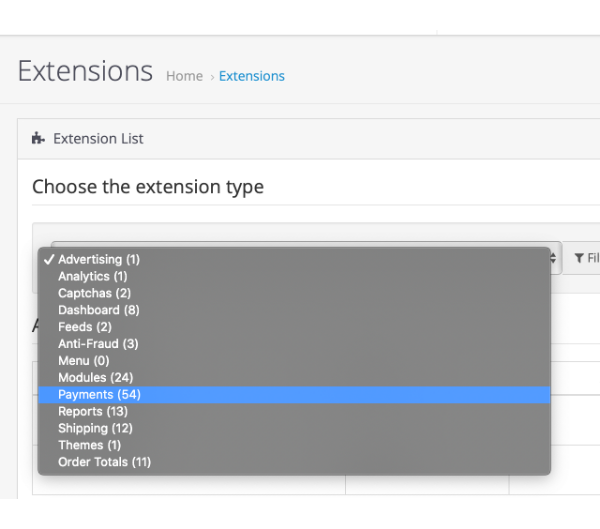
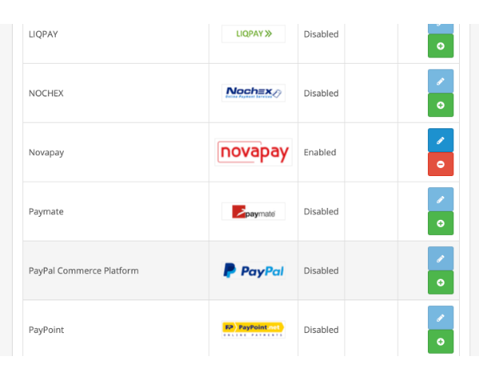
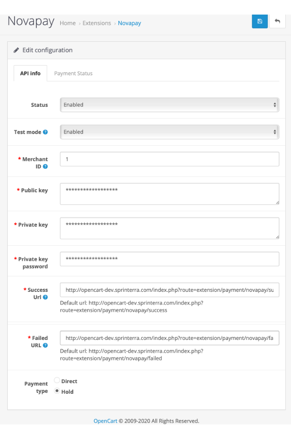
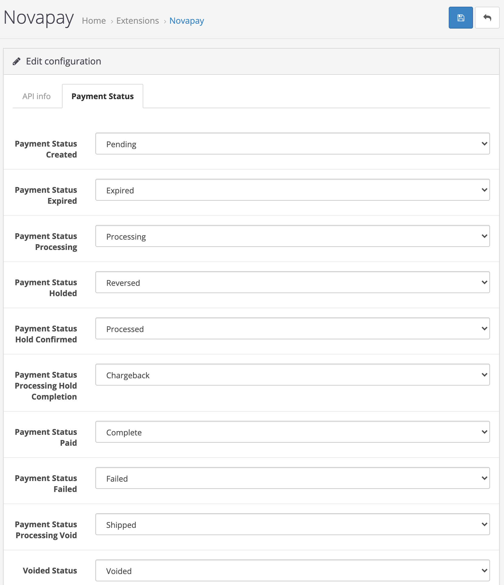
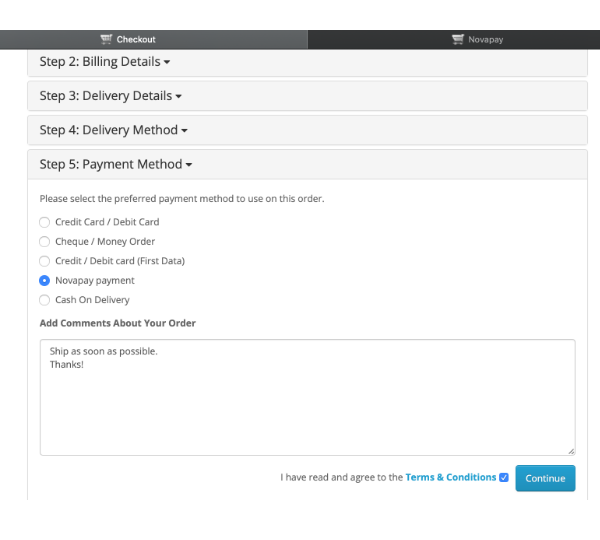
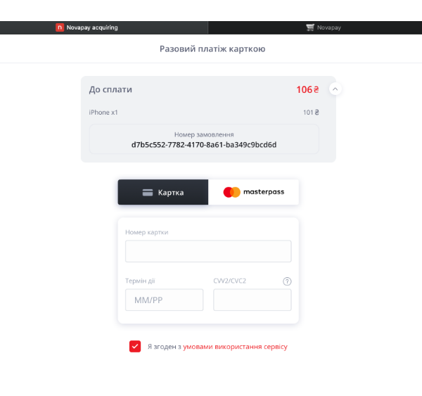

# Руководство по установке платежного шлюза Novapay в OpenCart 3

## Загрузка по FTP

1. Загрузите файлы (пример с [FTP-клиентом Filezilla] (https://filezilla-project.org/)) на ваш хостинг (сервер / облако):
    - Распакуйте ZIP архив и войдите в распакованую директорию  
    
    - Загрузите файлы на сервер в корневую директорию интернет-магазина `htdocs/`  
    
2. You can use any other available upload method, such as `ssh`, `hosting panel file manager`, etc.

## Настройка в панели администрирования

1. Войдите в панель администратора на своем интернет магазине, обычно URL-адрес `https://your-webshop-domain.com/admin/`, но он может быть изменен в конфигурации.  

2. Перейдите в Расширения.
    - Нажмите `Extensions` на боковой панели навигации  
    
    - Выберите `Extension type` в открытой странице  
    
    - Прокрутите вниз до платежного расширения `Novapay`  
    
3. Настройте расширение
    - API info
    
	    - Включите платежный модуль Novapay. Измените статус на **Enabled**.  
        - `Test mode` — LIVE (рабочий) или TEST (тестовый) режим;
        - `Merchant ID` — идентификатор продавца, предоставляемый Novapay;
        - `Public key` — публичный ключ для запроса postback API;
        - `Private key` — закрытый ключ для запросов API;
        - `Password private key` — пароль к закрытому ключу, используется только в LIVE режиме;
        - `Success Url` — url успешной страницы после обработки платежа;
        - `Fail Url` — url страницы с ошибкой после обработки платежа;
        - `Payment type` — тип платежа DIRECT (прямой) или HOLD (УДЕРЖАНИЕ);
	- Статусы оплат
    
        - `Payment Action Created` — установить состояние заказа при создании платежа;
        - `Payment Action Expired` — установить состояние заказа по истечении срока платежа;
        - `Payment Action Processing` — установить состояние заказа при обработке платежа;
        - `Payment Action Holded` — установить состояние заказа при удержании платежа;
        - `Payment Action Hold confirmed` — установить состояние заказа при подтверждении удержания платежа;
        - `Payment Action Hold completion` — установить состояние заказа при обработке	завершения удержания платежа;
        - `Payment Action Paid` — установить состояние заказа при успешной оплате;
        - `Payment Action Failed` — установить состояние заказа при неудачной оплате;
        - `Payment Action Processing void` — установить состояние заказа при аннулировании платежа;
        - `Payment Action Voided` — установить состояние заказа при аннулировании платежа;

## Тестирование на стороне интернет магазина
1. Зайдите в свой магазин и добавьте товар в корзину. Перейдите на страницу оформления заказа и заполните `Delivery method` шаг и перейти к `Payment method`.  
  
Вы должны увидеть переключатель **Novapay оплата**.
2. Есть ограничения для **Country**, **Telephone** и **Currency**. 
3. Если вся информация верна, Вы будете перенаправлены на обработку платежей.
