# Керівництво по установці платіжного шлюзу Novapay в OpenCart 3

## Завантаження по FTP

1. Завантажте файли (приклад з [Filezilla FTP client](https://filezilla-project.org/)) на Ваш хостинг (сервер / хмара):
    - Розпакуйте ZIP архів і увійдіть в распакованую директорію  
    
    - Завантажте файли на сервер в кореневу директорію інтернет-магазину `htdocs/`  
    
2. Ви можете вибрати будь який інший спосіб загрузки файлів `ssh`, `hosting panel file manager`, та інші.

## Налаштування в панелі адміністрування

### Модуль доставки
1. Перейдіть до Розширення.
    - Натисніть `Extensions` в боковій навігації  
    
    - Виберіть `Extension type` > `Shipping` на відкритій сторінці
    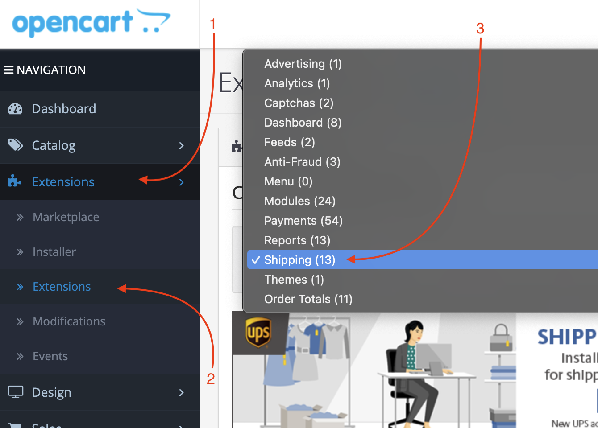
    - Прокрутіть униз до способу доставки `Novapay`
    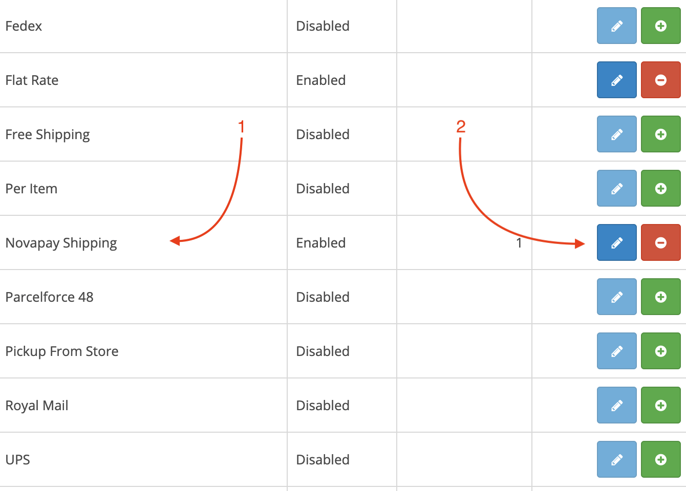
1. Налаштування розширення
    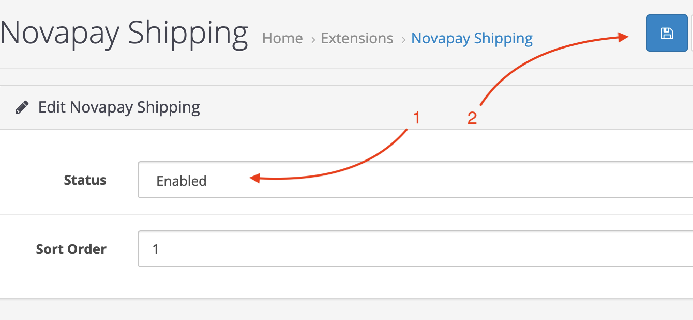
    - Статус `Enabled` або` Disabled`, включає або вимикає розширення
    - `Sort Order` - це номер для сортування способів доставки на сторінці оформлення замовлення від мінімального до максимального (за зростанням)
    > Розміри та одиниці ваги використовуються із стандартних налаштувань магазину.
1. Після налаштування способу доставки ви можете стежити за замовленнями з обраними методами доставки, щоб перевірити номер відстеження, роздрукувати його та відстежити доставку пакета.
    - Перейдіть до замовленнь `Sales` > `Orders`
    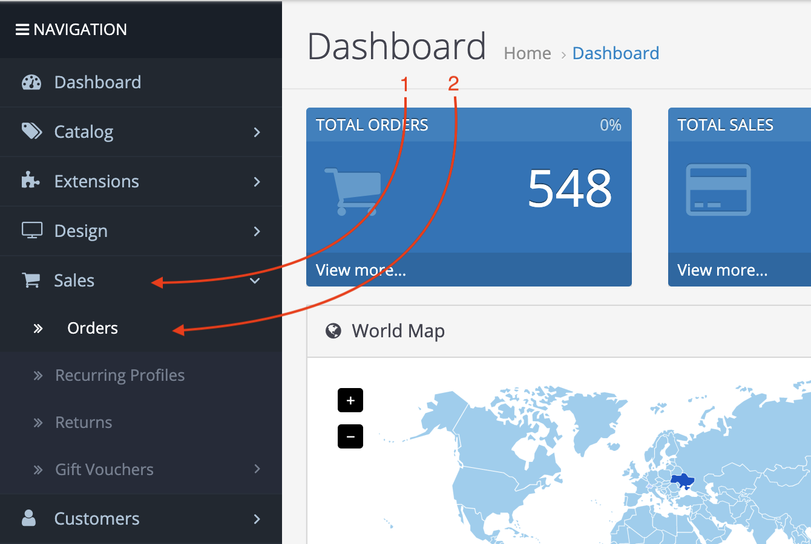
    - Перегляньте (клацніть) одне замовлення з доставкою Novapay
    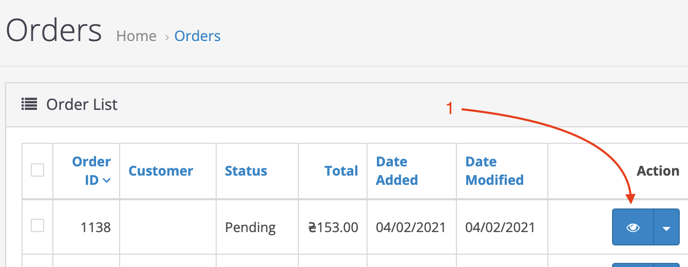
    - Перевірте інформацію про доставку в блоці Деталі замовлення
    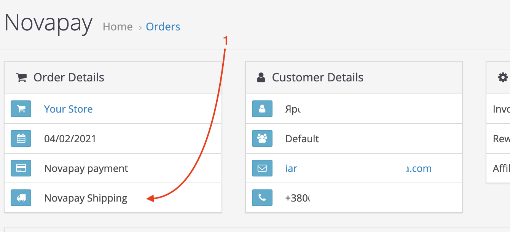
    - Прокрутіть вниз до `Order History` до та натисніть на вкладку` Novopay`
    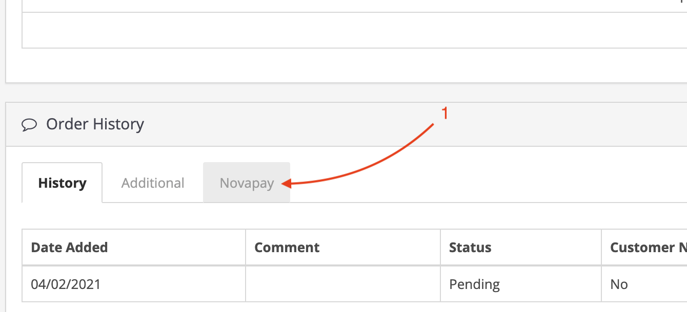
    - Натисніть кнопку `Confirm Hold`, коли будете готові доставити замовлення
    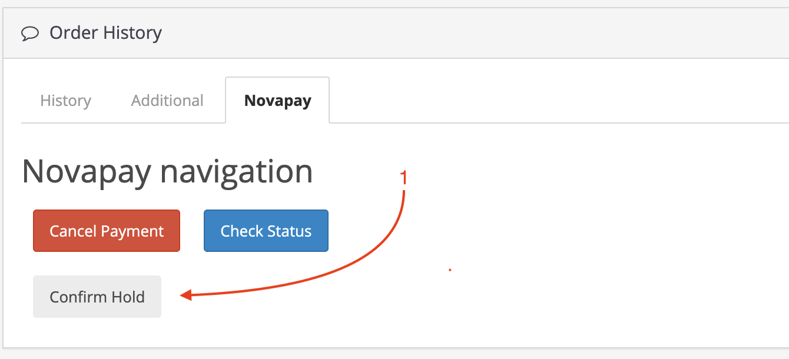
    - Коли підтвердження буде підтверджено (можливо треба буде натиснути `Check status`), ви побачите кнопку `Print PDF`.
    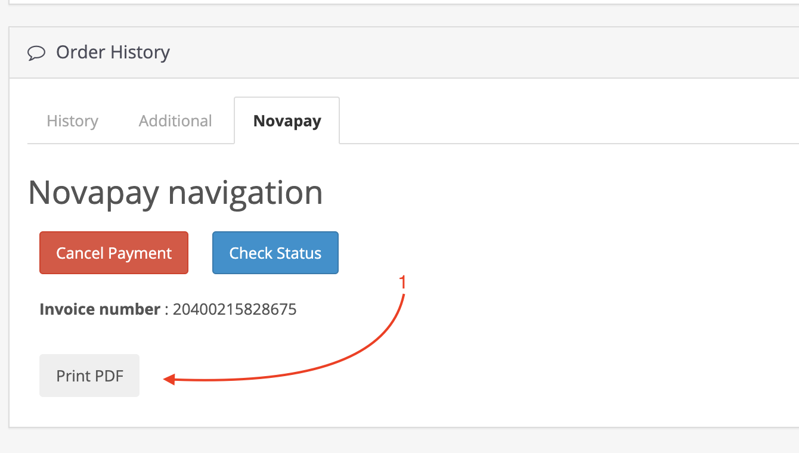
    - Щоб роздрукувати транспортний документ, натисніть кнопку `Print PDF`.
    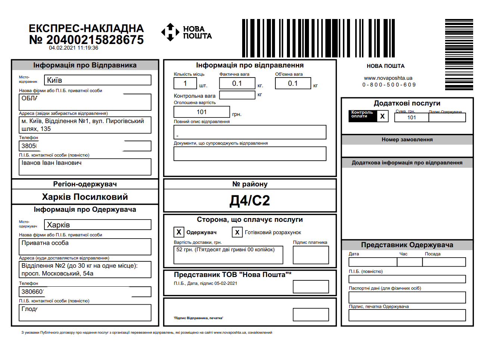

### Модуль оплати

1. Увійдіть в панель адміністратора на своєму інтернет магазині, зазвичай URL-адреса `https://your-webshop-domain.com/admin/`, але вона може бути змінений в конфігурації.  

1. Перейдіть в Розширення.
    - Натисніть `Extensions` на бічній панелі навігації  
    
    - Виберіть `Extension type` у відкритій сторінці
    
    - Прокрутіть вниз до платіжного розширення `Novapay`
    
1. Налаштуйте розширення
    - API info
    
        - Увімкніть платіжний модуль Novapay. Змініть статус на **Enabled**.  
        - `Test mode` — LIVE (робочий) або TEST (тестовий) режим;
        - `Merchant ID` — ідентифікатор продавця, що надається Novapay;
        - `Public key` — публічний ключ для запиту postback API;
        - `Private key` — приватний ключ для запитів API;
        - `Password private key` — пароль до приватного ключа, використовується тільки в LIVE режимі;
        - `Success Url` — url успішної сторінки після обробки платежу;
        - `Fail Url` — url сторінки з помилкою після обробки платежу;
        - `Payment type` — тип платежу DIRECT (прямий) або HOLD (утримання);
    - Статуси оплат
    
        - `Payment Action Created` — встановити стан замовлення при створенні платежу;
        - `Payment Action Expired` — встановити стан замовлення після закінчення терміну платежу;
        - `Payment Action Processing` — встановити стан замовлення при обробці платежу;
        - `Payment Action Holded` — встановити стан замовлення при утриманні платежу;
        - `Payment Action Hold confirmed` — встановити стан замовлення при підтвердженні утримання платежу;
        - `Payment Action Hold completion` — встановити стан замовлення при обробці завершення утримання платежу;
        - `Payment Action Paid` — встановити стан замовлення при успішну оплату;
        - `Payment Action Failed` — встановити стан замовлення при невдалій оплаті;
        - `Payment Action Processing void` — встановити стан замовлення при анулюванні платежу;
        - `Payment Action Voided` — встановити стан замовлення при анулюванні платежу;

## Тестування на стороні інтернет магазину

### Модуль доставки
1. Зайдіть у свій магазин і додайте товар у кошик для покупок. Перейдіть до каси, заповніть необхідну інформацію та перейдіть до кроку `Delivery Method`.
1. Виберіть `Novapay Shipping` і введіть назву міста.
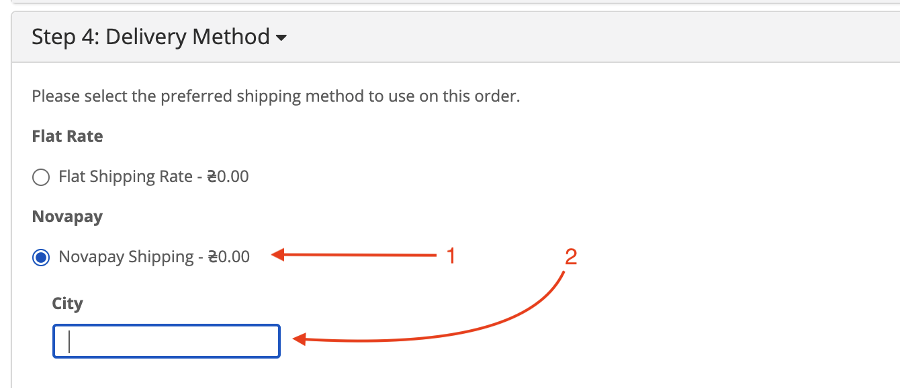
1. Коли введено місто (або кілька перших літер), виберіть потрібне місто зі спадного меню автозаповнення.
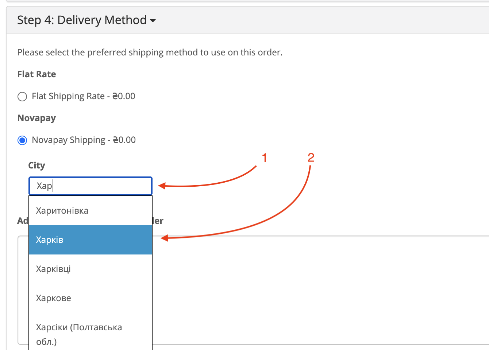
1. Перейдіть до наступного вводу `Department` та напишіть номер потрібного Вам відділення. Потім виберіть його зі спадного меню автозаповнення.
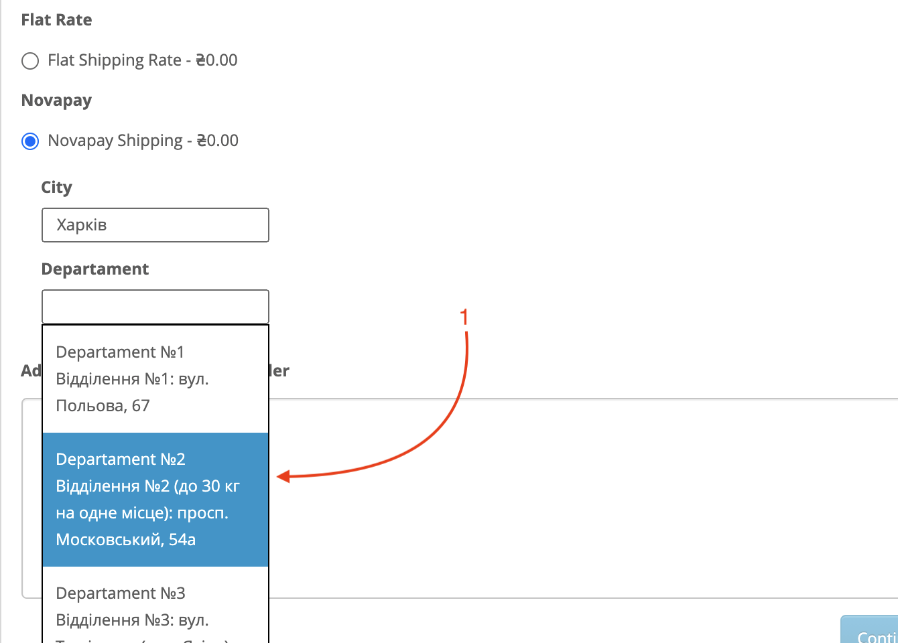
1. Вартість перевезення повинна бути перерахована та оновлена.
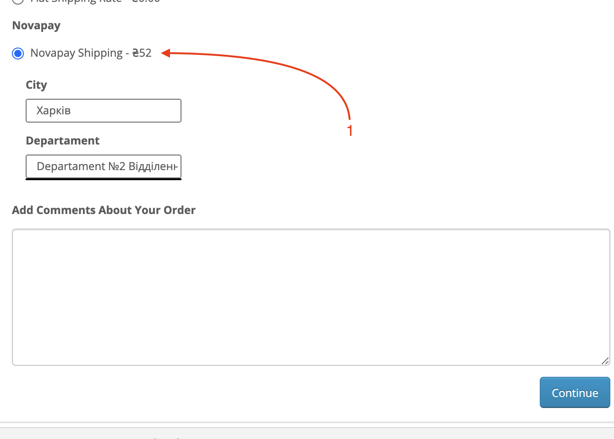
1. На кроці `Payment Method` ви можете вибрати лише `Novapay Payment`.
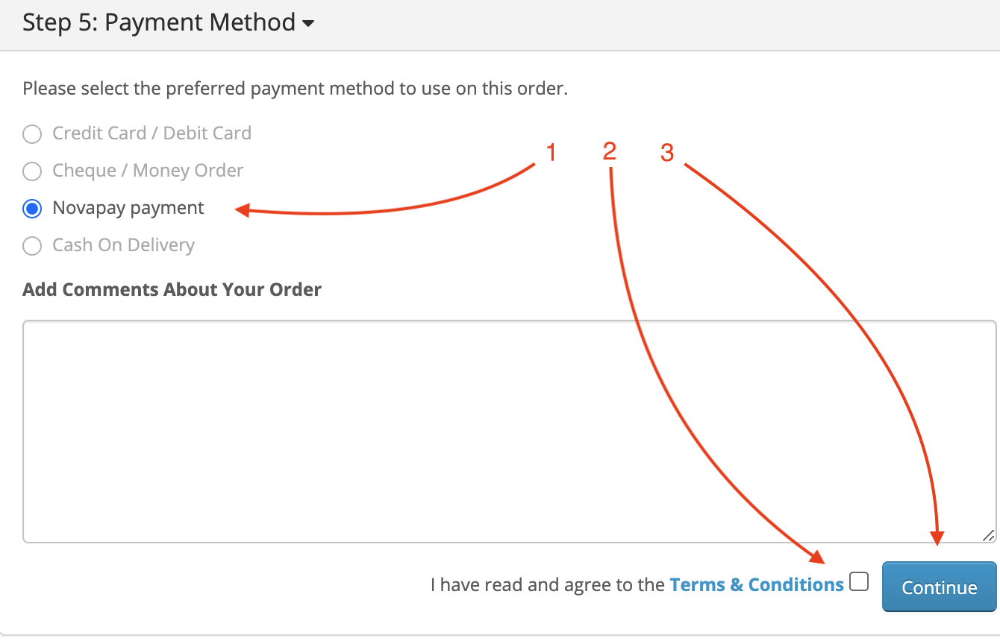
1. Після подання форми оформлення замовлення та переадресації на сторінку обробки платежів Novopay. Введіть дані картки для оплати. Ви можете побачити вартість доставки на цій сторінці.
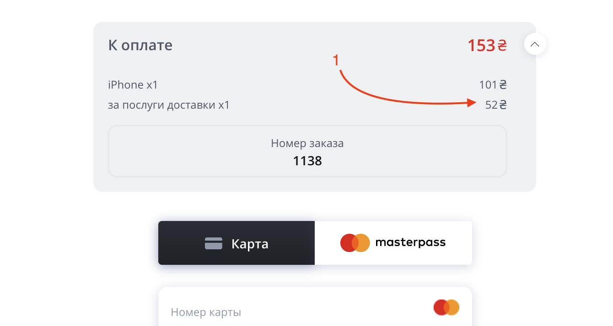

### Модуль оплати
1. Зайдіть в свій магазин і додайте товар в корзину. Перейдіть на сторінку оформлення замовлення і заповніть `Delivery method` крок і перейти до `Payment method`.  
  
Ви повинні побачити перемикач **Novapay payment**.
1. Є обмеження для **Country**, **Telephone** та **Currency**. 
1. Якщо вся інформація вірна, Ви будете перенаправлені на обробку платежів.
